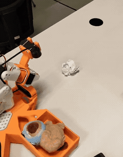
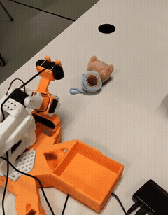
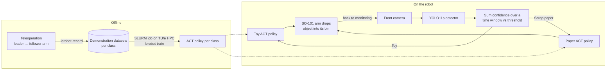

# Handy Robot — sorting household clutter with YOLO and imitation learning

A proof-of-concept robot built on a LeRobot SO-101 arm: a YOLO11s detector recognises a toy or a
piece of scrap paper, and an ACT policy trained for that class picks the object up and drops it
into the matching on-board bin. The whole detect → pick → sort loop runs autonomously;
success rate: **TBD (measured 2026-10-03)**.

<p align="center">
  
  
</p>

TU/e Honors Academy, AI track, 2025–2026. Three-person team, tutor Bram Grooten.

## Hardware

| Part | Details |
|---|---|
| Arm | LeRobot **SO-101** follower arm: 6 DOF with a parallel gripper. Its calibration is in [`configs/calibration/follower_arm.json`](configs/calibration/follower_arm.json). |
| Teleoperation | SO-101 **leader** arm. The operator moves it by hand and the follower copies its joint positions in real time. |
| Cameras | Two USB cameras, both 640×480 at 30 fps for the policies. **Front** is on the base, looks at the floor ahead and also feeds the detector. **Top** is near the gripper and gives a top-down view during the pick. |
| Base | 3D-printed (PLA) mobile base, designed in Siemens NX with topology optimization. It carries the arm, two side-mounted bins and a tricycle wheel layout (two powered rear wheels, one passive ball wheel). Mass went from 4.2 kg to 1.8 kg. The current prototype works from a fixed position; room navigation is out of scope. |
| Robot compute | A laptop with a GTX 1060 Mobile (6 GB VRAM) runs detection and the policies. The arm and cameras connect over a USB hub. |
| Training compute | TU/e HPC cluster, SLURM jobs on an RTX 2080 GPU node. |
| Cost | Under €1,000 of hardware, not counting the laptop. |

## Pipeline



1. **Demonstrations.** An operator teleoperates the follower arm with the leader arm. LeRobot
   records joint states together with frames from both cameras.
2. **Training.** One ACT (Action Chunking with Transformers) policy is trained per object class
   with LeRobot, as SLURM jobs on the TU/e HPC cluster.
3. **Detection.** YOLO11s runs on the front camera feed. The script does not react to a single
   frame. It adds up each class's confidence over a time window and compares the total with
   `window seconds × fps × minimum average confidence per frame`.
4. **Dispatch.** The winning class selects its ACT policy, and the arm places the object in the
   matching bin.
5. **Loop.** The system goes back to monitoring. Detection and the policy both need the same
   camera, and a blocked frame read could keep the device open. So detection runs as a separate
   process that reports one class and exits, which frees the camera before the policy starts.

## Data

**ACT demonstrations** (final datasets, recorded on the mobile base):

| | Toy | Scrap paper |
|---|---|---|
| Episodes | 81 | 60 |
| What varies | 1 position, 8 orientations (about 10 episodes each) | 9 positions on a 3×3 grid |
| Frames (30 fps) | 48,484 | 32,472 |

- **Why the datasets differ.** The paper ball looks the same from every side, so only its
  position varies: a 3×3 grid was drawn on a cardboard panel taped in front of the base. The
  toy is asymmetric and the grasp depends on how it is turned, so its orientation varies
  instead.
- **Earlier datasets.** Before the base existed, tabletop datasets were recorded with a tea bag
  box starting inside a 2–3 cm radius. They were used to learn how much data ACT needs.
<!-- TODO: was part of the ACT data held out for validation, or did the policies train on all episodes? -->

**YOLO detector dataset:**

- **Collection.** The objects were filmed in different rooms and under different lighting.
  Every 5th frame was extracted and labelled by hand in Label Studio.
- **Size.** About 1,000 images, including augmented copies.
- **Classes.** Toy, scrap paper and recyclable. Recyclable was trained as groundwork for a
  future class and has no arm policy.
- **Split.** 85/15 train/validation, stratified by lighting condition. There is no test set.

## Training

**ACT policies**

| | Toy | Scrap paper |
|---|---|---|
| Training steps | 50,000 | 40,000 |
| Shared settings | chunk size 100, batch size 8, learning rate 1e-5, two cameras (640×480) | same |
| Hardware | TU/e HPC, SLURM, RTX 2080 | same |

- **Why the cluster.** On the laptop (GTX 1060 Mobile), about 100 episodes took close to two
  days to train. On the cluster, training took hours instead of days.
<!-- TODO: how long did each final ACT run take on the RTX 2080 (hours, or GPU-hours)? -->
- **Why ACT.** It is LeRobot's recommended policy for GPUs under 8 GB VRAM and for single-task
  grasp-and-place. It was designed for about 50–100 demonstrations, which matches what we could
  record by hand. ACT was not benchmarked against Diffusion Policy or VQ-BeT.

**YOLO11s detector**

- **Setup.** Fine-tuned from pretrained `yolo11s.pt` with default Ultralytics augmentations. Up
  to 120 epochs with early stopping (patience 30), input size 896, batch size 4.
- **Run.** From the metadata in [`image_classification/best.pt`](image_classification/best.pt):
  training stopped after 70 epochs, and the logged training time was about 29 minutes.
<!-- TODO: on which machine was YOLO trained? -->

## Results

**End-to-end sorting.** No success rate has been measured yet. The table below will be filled
in after the trial run.

| Class | Trials | Successes | Success rate | Missed detection | Wrong class | Missed grasp | Wrong bin | Failed recovery |
|---|---|---|---|---|---|---|---|---|
| Toy | TBD | TBD | TBD (measured 2026-10-03) | TBD | TBD | TBD | TBD | TBD |
| Scrap paper | TBD | TBD | TBD (measured 2026-10-03) | TBD | TBD | TBD | TBD | TBD |

<!-- TODO: test protocol. How many trials per class, and which start positions and orientations? -->

**YOLO11s detector, validation set**

| Metric | `best.pt` (epoch 40) | Last epoch (70) |
|---|---|---|
| Precision | 0.981 | 0.986 |
| Recall | 0.983 | 0.989 |
| mAP@50 | 0.986 | 0.990 |
| mAP@50–95 | 0.782 | 0.779 |

- **Source.** Both columns come from the training log stored in `best.pt`. The report quotes
  the last-epoch values rounded (0.99 / 0.99 / 0.99 / 0.78). `best.pt` is the checkpoint used
  on the robot.
- **Caveat.** Validation frames come from the same videos as the training frames, and each
  class has very few physical objects. These numbers describe these objects in these rooms,
  not unseen household items.

## What didn't work / limitations

- **Recovery after a missed grasp.** This is the main failure mode. The demonstrations contain
  almost only successful picks, so the policy has no example of what to do after a miss.
- **Rear-mounted bins (base design 1).** To reach bins at the rear, the arm swung each object
  over the chassis. After a missed grasp the policy snapped back to its start pose, which shook
  the tall, narrow base. The same happened when two objects were in view. Lowering the control
  frequency only softened the symptom. Moving the bins to the sides (design 2) and retraining
  the policies stopped the shaking.
- **Temporal ensembling.** We tried ACT's temporal ensembling to smooth motion. On the laptop's
  GTX 1060, querying the policy every step lowered the control frequency, and the averaging
  lagged behind the arm so the gripper stopped short of the object. We went back to plain
  chunked execution.
- **Generalization.** Each policy was trained on essentially one physical object and only works
  for the positions and orientations it was shown. It degrades elsewhere and on other surfaces.
  On the tabletop, success dropped quickly outside the 2–3 cm starting radius.
- **Shape over colour.** The tabletop policy was trained on a tea bag box. It closed the gripper
  at the wrong height on a yellow piece of cheese, and it still tried to pick up a box it had
  never seen. Placement was much less precise than picking.
- **Detector data leakage.** Near-identical neighbouring frames can end up in both train and
  validation, which likely inflates the metrics. A split by time within each video would fix
  this. The model was not retrained.
- **One class-conditioned ACT.** Feeding the class label into a single ACT policy would have
  meant changes across LeRobot's dataset, recording, training and inference code. We kept one
  policy per class, and the two approaches were never compared.
- **No evaluation protocol from the start.** The system was demonstrated in person, but no
  success rate was recorded during the project. That is why the Results table is still TBD.
- **Setup and scope.** LeRobot would not install under WSL (the `evdev` build fails), so we used
  native Ubuntu. The prototype works from a fixed position; navigation, on-board compute and
  docking are future work.

## Team & my role

**My role:** project management / Scrum master; recording the demonstration datasets;
launching training on the cluster via SLURM; the policy dispatch and execution loop that runs
the selected ACT policy after detection, built together with Rovshan Ayyubov.

**Teammates' contributions:**

- **Rovshan Ayyubov** — object classification: YOLO dataset collection and preparation,
  labelling, training and evaluation. Also the confidence-aggregation trigger and, together
  with me, the detection-to-policy integration.
- **Francisco Fernández Gutiérrez** — mechanical design: the mobile base in Siemens NX, the
  MATLAB stability analysis and the topology optimization. Also helped label the YOLO dataset
  and record demonstrations.

## How to reproduce

These are the LeRobot commands the team used. The ports, dataset names and task strings are
examples, so replace them with your own.

<details>
<summary>Set-up, calibration, teleoperation, recording, training, running a policy</summary>

### Set-up
```bash
conda activate lerobot
cd lerobot
sudo chmod 666 /dev/ttyACM*
lerobot-find-port
lerobot-find-cameras opencv
```

When only one arm is connected it can show up on either port. If a command fails because of
the port, switch between `ACM0` and `ACM1`.

### Calibrate
```bash
lerobot-calibrate \
    --robot.type=so101_follower \
    --robot.port=/dev/ttyACM0 \
    --robot.id=follower_arm

lerobot-calibrate \
    --teleop.type=so101_leader \
    --teleop.port=/dev/ttyACM1 \
    --teleop.id=leader_arm
```

### Teleoperate
```bash
lerobot-teleoperate \
    --robot.type=so101_follower \
    --robot.port=/dev/ttyACM0 \
    --robot.id=follower_arm \
    --robot.cameras="{ front: {type: opencv, index_or_path: 0, width: 640, height: 480, fps: 30}, top: {type: opencv, index_or_path: 2, width: 640, height: 480, fps: 30}}" \
    --teleop.type=so101_leader \
    --teleop.port=/dev/ttyACM1 \
    --teleop.id=leader_arm \
    --display_data=true
```

### Record demonstrations
```bash
lerobot-record \
    --robot.type=so101_follower \
    --robot.port=/dev/ttyACM1 \
    --robot.id=follower_arm \
    --robot.cameras="{front: {type: opencv, index_or_path: 0, width: 640, height: 480, fps: 30}, top: {type: opencv, index_or_path: 2, width: 640, height: 480, fps: 30}}" \
    --teleop.type=so101_leader \
    --teleop.port=/dev/ttyACM0 \
    --teleop.id=leader_arm \
    --display_data=true \
    --dataset.repo_id="MrPsarik/PaperBalls" \
    --dataset.num_episodes=5 \
    --dataset.single_task="Put a paper ball into the robot container" \
    --dataset.reset_time_s=30
```
Add `--resume=true` to keep recording into an existing dataset.

### Replay one episode
```bash
lerobot-replay \
    --robot.type=so101_follower \
    --robot.port=/dev/ttyACM1 \
    --robot.id=follower_arm \
    --dataset.repo_id=MrPsarik/t \
    --dataset.episode=0
```

### Train an ACT policy
```bash
lerobot-train \
    --dataset.repo_id="MrPsarik/t" \
    --policy.type=act \
    --output_dir=outputs/train/t_policy \
    --job_name=t_policy \
    --policy.device=cuda \
    --wandb.enable=true \
    --policy.repo_id="MrPsarik/t_policy" \
    --save_freq=5000 \
    --steps=100000

# resume
lerobot-train \
    --resume=true \
    --steps=100000 \
    --config_path=outputs/train/t_policy/checkpoints/last/pretrained_model/train_config.json
```
The final policies used 50,000 steps (toy) and 40,000 steps (scrap paper). See [Training](#training).

### Run a trained policy
```bash
rm -rf ~/.cache/huggingface/lerobot/MrPsarik/eval_t   # clear the eval cache before each run

lerobot-record \
    --robot.type=so101_follower \
    --robot.port=/dev/ttyACM0 \
    --robot.cameras="{front: {type: opencv, index_or_path: 0, width: 640, height: 480, fps: 30}, top: {type: opencv, index_or_path: 2, width: 640, height: 480, fps: 30}}" \
    --robot.id=follower_arm \
    --display_data=false \
    --dataset.repo_id=MrPsarik/eval_t \
    --dataset.single_task="Move yellow block" \
    --policy.path=MrPsarik/t_policy
```

### Detector only
```bash
cd image_classification
python live_detect.py --model best.pt --camera 0   # press q to quit
```

</details>

**Not reproducible from this repo yet:**

- **SLURM job script.** Not in the repo yet. <!-- TODO: add the SLURM job script to the repo. -->
- **Integration loop.** The version in `image_classification/` (`fake_robot.py`,
  `policy_manager.py`) is an early one. It replays recorded movements instead of running the
  ACT policies, and `policy_manager.py` is missing `import sys`.
  <!-- TODO: push the final integration code (with detection as a separate process) from the Honors laptop. -->
<!-- TODO: what are the Hugging Face Hub IDs of the final toy and scrap-paper datasets and policies? -->

## License

Apache 2.0 — see [LICENSE](LICENSE).
